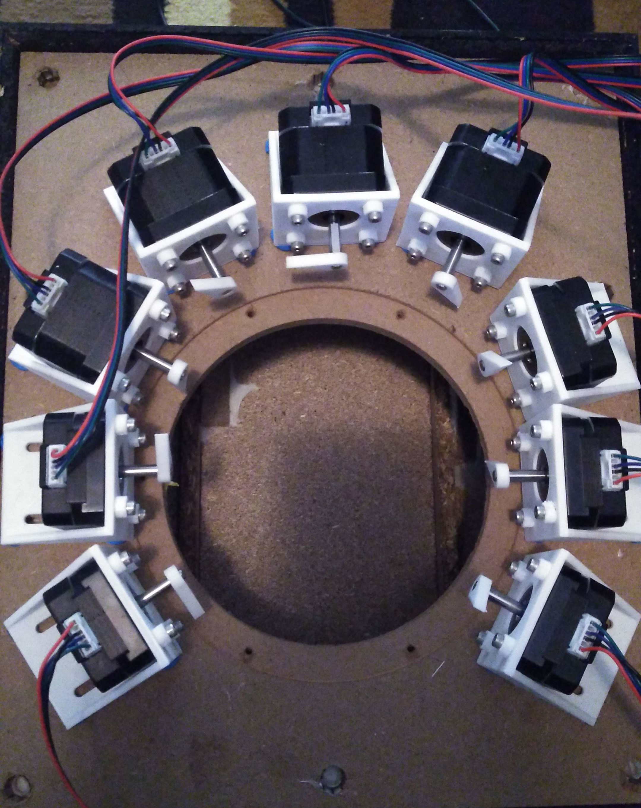
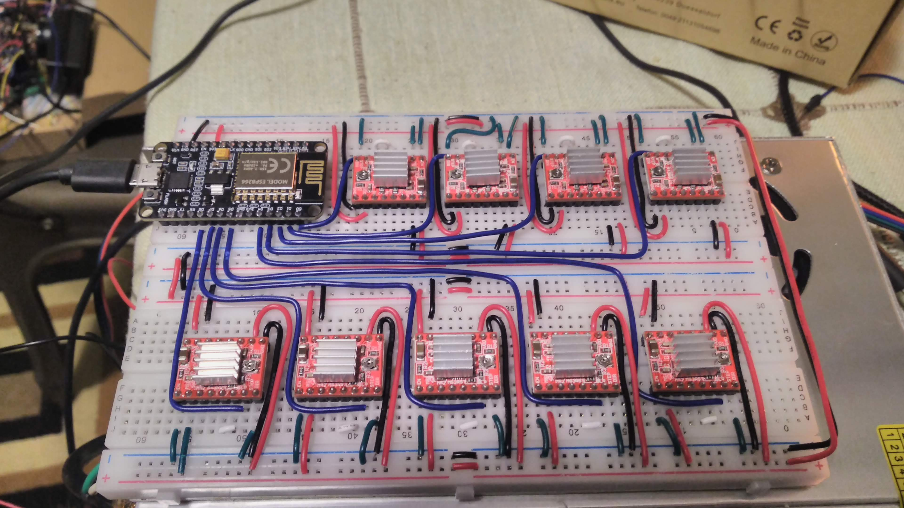
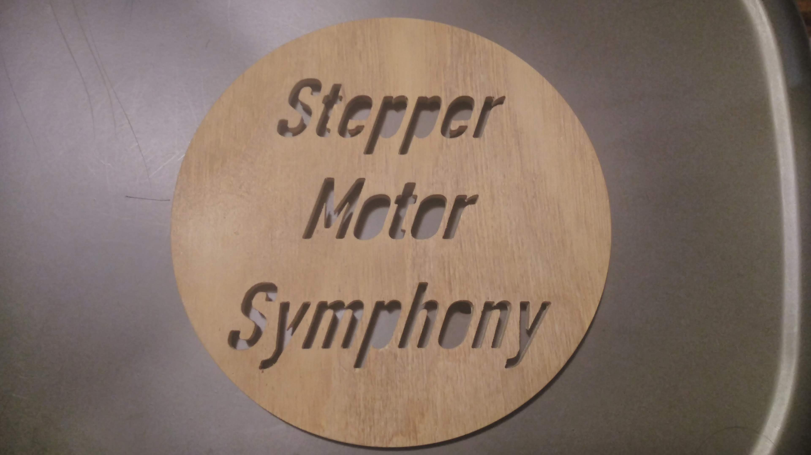

## Members
Dylan Green, Computer Engineering Student (2024), dylang@vt.edu

## Repo Link
<a class="button is-link" href="https://github.com/Amp-Lab-at-VT/Stepper_Motor_Symphony" >Stepper Motor Symphony</a>

## Photo

## Mentor
Richard Gibbons

## Current Status
In Progress

## Project Overview
This project is a music box that uses electric motors to create sound! The software side of the project is a custom command-line tool that translates MIDI music files into an Arduino code file. This code can be uploaded to most Arduino-compatible microcontrollers and will send signals on the data pins to motor drivers. These signals correspond to specific frequencies the stepper motors will step at, recreating the original music.

## Educational Value Added
This project will help me learn about working with microcontroller timing code and high performance programming. Specifically, the microcontroller code must run with strict time constraints to ensure notes are played on the stepper motors with the right frequency. In addition, I will learn how to make a command-line interface that is as user-friendly as possible, even for those with little programming background.

## Tasks
* Finish implementing CommandPrompt class
* Modify MIDI translator to accept tempo changes
* Add a note->motor assignment mode that preserves the original MIDI tracks

## Design Decisions
One of the goals motivating my design decisions is that I want all of the parts I use in the project to be easily accessible by anyone who wants to build their own version of this project. Because of this, I will only be using inexpensive off-the-shelf components and open-source code libraries. During early testing, I noticed that having the Arduino Uno drive more than 3 stepper motors at once caused many notes to sound flat. I believe this is due to the microcontroller being too slow to do what I wanted it to, so I switched to an ESP8266 soon after. However, the Arduino Uno seems to perform well with only 1 or 2 motors.

## Design Misc
The MIDI translator tool is written in Java so that I can use JFugue, an extensive music programming library that supports MIDI parsing. Aside from that, Java is easy to use and performs well even when processing large MIDI files.

## Steps for Documenting Your Design Process

## BOM + Component Cost
* 1x ESP8266 microcontroller - $4
* 9x A4988 stepper motor driver - $2 each
* 9x NEMA 17 stepper motor - $10 each
* 1x Speaker box - variable cost

## Timeline
* August 2021 - Created first prototype running hand-coded music with an Arduino Uno and two stepper motors
* May 2022 - Finished first MIDI translator implementation and ran automatically-generated music code for the first time
* September 2022 - Ported the generated .ino code to run on ESP8266 for higher speed, added project to Virginia Tech AMP Lab
* November 2022 - Started rewriting MIDI translator to make use of more JFugue library functions
* December 2022 - Finished second version of MIDI translator, now translating files with much greater reliability
* January 2023 - Expanded to nine stepper motors, added speaker box for resonance and greatly improved sound quality
* March 2023 - Planning to finish implementing CommandPrompt class and add support for tempo changes
* April 2023 - Planning to add track-preserving note assignment mode (current and only mode simply assigns notes to the first available motor)

## Useful Links
<a class="button is-link" href="https://www.explainthatstuff.com/how-stepper-motors-work.html" >How do stepper motors work?</a>

## Log
